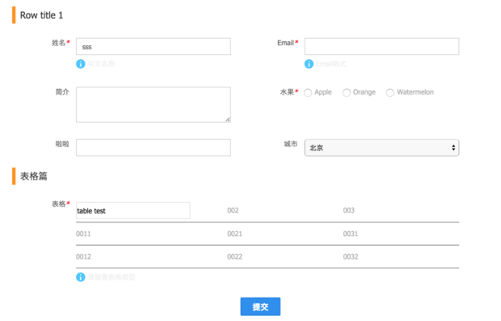

# uxcore-form

---

* tag: uxcore, form
* description: 让form代码变的简单，可配
* maintainers: 骁勇
* version: 1.0.0
* lastupdate: 7/5/2015
* screenshots: example/screenshot.png




## TL;DR


## Feature List/特性


## Usage 最佳实践 [demo](http://uxcore.github.io/uxcore-form/)

```sh
$ git clone https://github.com/uxcore/uxcore-form
$ cd uxcore-form
$ npm install
$ npm run dev
```


### Apply scope

* uxcore-form, including form common validation, layout etc

## API

*  Attr

	* jsxname
    * jsxdata
    * jsxmode
    * jsxprefixCls
    * jsxrule
    * jsxvalue

* Form API

    * doValidate
    * isDirty

* Form Field API

    * handleChange
    * doValidate
    * getValue
    * getForm

## FormField 接口方法

后续FormField会越来越多，成为FormField,几个条件需要满足:

* 继承FormField
* handleChange需要覆盖重写,这个方法是FormField数据变化时，验证和数据回流到Form的入口
* render方法需要注意，里面有两个jsxmode状态,需要写对应两种状态下的UI, 分别是view/edit

## work flow

* Form-> Render-> FormField register to Form (this.fields) by jsxname
* FormField -> Render -> view UI or Edit UI
* FormField -> data Change -> use handleDataChange hook method pass back to Form